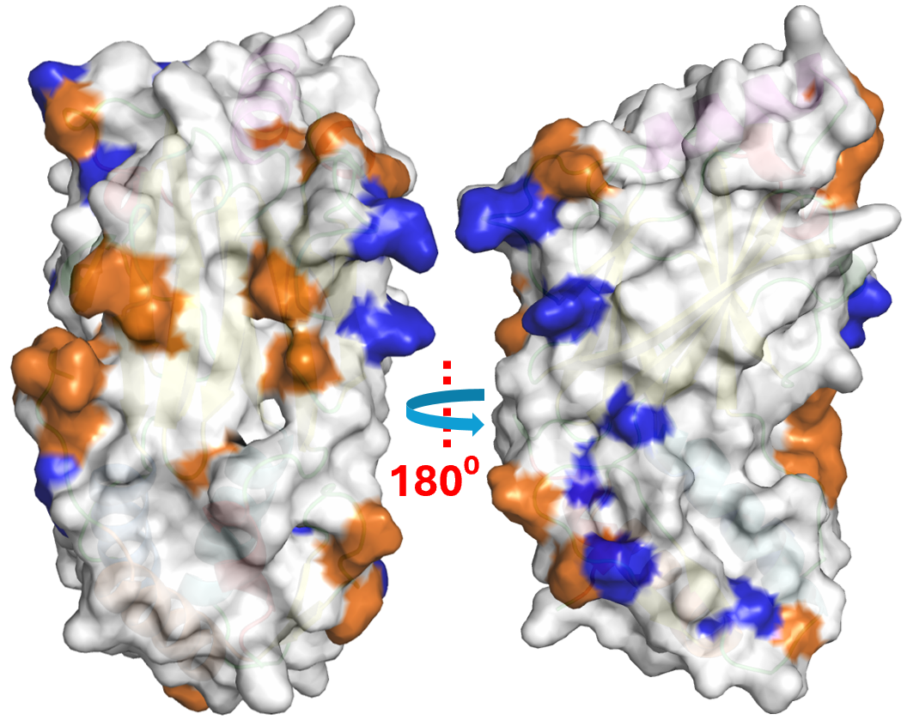

  <strong style="font-size: 30px;">Hydrophobic Regions and Druggable Binding Sites on Interferon      Regulatory Factor 3 Protein Identified Using Dewetting and Mixed Solvent Simulations</strong>

  
   
  <em>Hydrophobic (orange) and hydrophilic (blue) regions on the IRF3 protein chain.</em>

This repository contains data and scripts related to the analysis of MixMD and dewetting simulations of the IRF3 protein. The project is organized into several folders, each serving a specific purpose:

## Folder Structure

- [**dewetting_data/**](./dewetting_data/)  
  Contains CSV files with the number of water molecules within 4 Å of each residue, calculated for coordination number ranges from 612 to 2142. Each file corresponds to a specific coordination number window.

- [**probe_parameters/**](./probe_parameters/)    
  Includes force field parameter files for the probes used in the simulations. Probes include IMI, C3N, EOH, IPA, and NMA.

- [**scaled_probe_density/**](./scaled_probe_density/)  
  Contains probe density data obtained from MixMD simulations, as well as Python scripts ( [`load_all_outer_protein.py`](scaled_probe_density/load_all_outer_protein.py)) to visualize these probe densities in PyMOL.

## Usage

1. **Dewetting Data Analysis:**  
   The CSV files in `dewetting_data/` can be used to analyze the hydration environment of each residue across different coordination number ranges.

2. **Force Field Parameters:**   
   The files in `probe_parameters/` provide the necessary parameters for running simulations with the specified probes.

3. **Probe Density Visualization:**  
   Use the script in `scaled_probe_density/` to load and visualize probe density maps in PyMOL. For example, [`load_all_outer_protein.py`](scaled_probe_density/load_all_outer_protein.py) demonstrates how to render protein structures and overlay probe density isomeshes.

## Requirements

- [PyMOL](https://pymol.org/) (for visualization)
- Python 3.x (for running visualization scripts)

